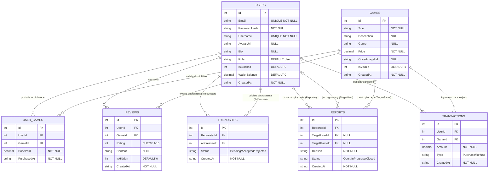

# GameHub — Schemat bazy danych (ERD)

> **Baza:** SQLite · **ORM:** Entity Framework Core 8  
> **Opcja portfela:** A — pole `WalletBalance` w tabeli `Users` (tabela `WalletTransactions` odpada)

---

## Diagram ERD



---

## Tabele — szczegóły

### USERS

| Kolumna | Typ | Ograniczenia |
|---|---|---|
| Id | INTEGER | PK, AUTOINCREMENT |
| Email | TEXT | NOT NULL, UNIQUE |
| PasswordHash | TEXT | NOT NULL |
| Username | TEXT | NOT NULL, UNIQUE |
| AvatarUrl | TEXT | NULL |
| Bio | TEXT | NULL |
| Role | TEXT | NOT NULL, DEFAULT `'User'` |
| IsBlocked | INTEGER | NOT NULL, DEFAULT `0` |
| WalletBalance | DECIMAL | NOT NULL, DEFAULT `0` |
| CreatedAt | TEXT | NOT NULL |

### GAMES

| Kolumna | Typ | Ograniczenia |
|---|---|---|
| Id | INTEGER | PK, AUTOINCREMENT |
| Title | TEXT | NOT NULL |
| Description | TEXT | NULL |
| Genre | TEXT | NULL |
| Price | DECIMAL | NOT NULL |
| CoverImageUrl | TEXT | NULL |
| IsVisible | INTEGER | NOT NULL, DEFAULT `1` |
| CreatedAt | TEXT | NOT NULL |

### USER_GAMES

| Kolumna | Typ | Ograniczenia |
|---|---|---|
| Id | INTEGER | PK, AUTOINCREMENT |
| UserId | INTEGER | FK → Users.Id |
| GameId | INTEGER | FK → Games.Id |
| PricePaid | DECIMAL | NOT NULL |
| PurchasedAt | TEXT | NOT NULL |

**Constraint:** UNIQUE(UserId, GameId) — jeden user nie może kupić tej samej gry dwa razy.

### REVIEWS

| Kolumna | Typ | Ograniczenia |
|---|---|---|
| Id | INTEGER | PK, AUTOINCREMENT |
| UserId | INTEGER | FK → Users.Id |
| GameId | INTEGER | FK → Games.Id |
| Rating | INTEGER | NOT NULL, CHECK(Rating BETWEEN 1 AND 10) |
| Content | TEXT | NULL |
| IsHidden | INTEGER | NOT NULL, DEFAULT `0` |
| CreatedAt | TEXT | NOT NULL |

**Constraint:** UNIQUE(UserId, GameId) — jedna recenzja na grę per użytkownik.

### FRIENDSHIPS

| Kolumna | Typ | Ograniczenia |
|---|---|---|
| Id | INTEGER | PK, AUTOINCREMENT |
| RequesterId | INTEGER | FK → Users.Id |
| AddresseeId | INTEGER | FK → Users.Id |
| Status | TEXT | NOT NULL, DEFAULT `'Pending'` · wartości: `Pending / Accepted / Rejected` |
| CreatedAt | TEXT | NOT NULL |

**Constraint:** UNIQUE(RequesterId, AddresseeId) — jeden kierunek zaproszenia.

### REPORTS

| Kolumna | Typ | Ograniczenia |
|---|---|---|
| Id | INTEGER | PK, AUTOINCREMENT |
| ReporterId | INTEGER | FK → Users.Id |
| TargetUserId | INTEGER | FK → Users.Id · NULL |
| TargetGameId | INTEGER | FK → Games.Id · NULL |
| Reason | TEXT | NOT NULL |
| Status | TEXT | NOT NULL, DEFAULT `'Open'` · wartości: `Open / InProgress / Closed` |
| CreatedAt | TEXT | NOT NULL |

**Reguła biznesowa:** Dokładnie jedno z `TargetUserId` / `TargetGameId` musi być wypełnione. Walidacja w warstwie Application — nie na poziomie bazy.

### TRANSACTIONS

| Kolumna | Typ | Ograniczenia |
|---|---|---|
| Id | INTEGER | PK, AUTOINCREMENT |
| UserId | INTEGER | FK → Users.Id |
| GameId | INTEGER | FK → Games.Id |
| Amount | DECIMAL | NOT NULL |
| Type | TEXT | NOT NULL · wartości: `Purchase / Refund` |
| CreatedAt | TEXT | NOT NULL |

---

## Relacje — podsumowanie

| Relacja | Kardynalność | Opis |
|---|---|---|
| Users → UserGames | `1 do 0..*` | Użytkownik ma zero lub wiele gier w bibliotece |
| Games → UserGames | `1 do 0..*` | Gra może być w zero lub wielu bibliotekach |
| Users → Reviews | `1 do 0..*` | Użytkownik pisze zero lub wiele recenzji |
| Games → Reviews | `1 do 0..*` | Gra ma zero lub wiele recenzji |
| Users → Friendships (Requester) | `1 do 0..*` | Użytkownik wysyła zero lub wiele zaproszeń |
| Users → Friendships (Addressee) | `1 do 0..*` | Użytkownik odbiera zero lub wiele zaproszeń |
| Users → Reports (Reporter) | `1 do 0..*` | Użytkownik składa zero lub wiele zgłoszeń |
| Users → Reports (TargetUser) | `0..1 do 0..*` | Zgłoszenie opcjonalnie dotyczy użytkownika |
| Games → Reports (TargetGame) | `0..1 do 0..*` | Zgłoszenie opcjonalnie dotyczy gry |
| Users → Transactions | `1 do 0..*` | Użytkownik ma zero lub wiele transakcji |
| Games → Transactions | `1 do 0..*` | Gra figuruje w zero lub wielu transakcjach |

---

## Decyzje projektowe

### Dlaczego Opcja A (WalletBalance w Users)?

Opcja B (`WalletTransactions`) to osobna tabela historii operacji portfela niezależna od historii zakupów. Przy naszym zakresie wystarczy:
- `WalletBalance` w `Users` jako bieżące saldo
- `Transactions` jako historia wszystkich operacji (TopUp dodamy jako typ w `Type`)

To upraszcza zapytania i redukuje liczbę JOIN-ów.

### Typy dat jako TEXT w SQLite

SQLite nie ma natywnego typu `DATETIME`. Przechowujemy daty jako `TEXT` w formacie ISO 8601 (`YYYY-MM-DDTHH:mm:ssZ`). EF Core mapuje to automatycznie na `DateTime` w C#.

### Soft delete zamiast hard delete

- Gry: `IsVisible = 0` (nie usuwamy z bazy, zachowujemy historię transakcji)
- Recenzje: `IsHidden = 0/1` (moderacja bez usuwania)
- Użytkownicy: `IsBlocked = 0/1` (blokada zamiast usunięcia)
```
